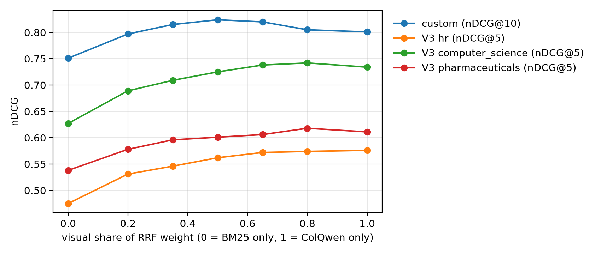

# ViDoRe V3 results: retrieval, cropping, generation, answer correctness

Final run 2026-10-07 on a Kaggle T4, one session (~4.5 GPU-h):
`scripts/test_kaggle.sh --dataset <you>/mira-custom-embeddings --run 'bash scripts/kaggle_full_eval.sh' mira-full`.
Full log: `data/eval/kaggle_mira-full.log` (gitignored). Every generated answer, with its
evidence boxes, timings and the judge's verdict and reason: `data/eval/generation_<subset>.jsonl`.

**Setup**
- Subsets (English queries only): `hr` (1,110 pages, 318 queries), `computer_science` (1,360 pages,
  215), `pharmaceuticals` (2,313 pages, 364). `hr` is the subset the cropping parameters were tuned
  on; the other two are held out. Nothing in retrieval was tuned on V3.
- Retrieval: ColQwen2.5 fp16, exact MaxSim in Qdrant; BM25 on V3's `markdown` page text; weighted
  RRF, k = 60, 50 candidates per channel.
- Metrics: graded nDCG (2 = fully relevant, 1 = critically relevant), as in ViDoRe. Recall and MRR
  count any grade as relevant.

## Retrieval (Phase 4)

| Subset | Mode | R@5 | R@10 | MRR | **nDCG@5** | nDCG@10 |
|---|---|---:|---:|---:|---:|---:|
| hr (318) | adaptive | 0.495 | 0.637 | 0.709 | 0.558 | 0.591 |
| | fixed | 0.499 | 0.637 | 0.712 | 0.562 | 0.594 |
| | **visual** | **0.532** | **0.651** | 0.705 | **0.576** | **0.601** |
| | lexical | 0.429 | 0.544 | 0.613 | 0.475 | 0.496 |
| computer_science (215) | adaptive | 0.644 | 0.781 | 0.874 | 0.722 | 0.753 |
| | fixed | 0.647 | 0.781 | 0.878 | 0.725 | 0.754 |
| | **visual** | **0.654** | **0.809** | 0.873 | **0.734** | **0.768** |
| | lexical | 0.562 | 0.683 | 0.805 | 0.627 | 0.656 |
| pharmaceuticals (364) | adaptive | 0.554 | 0.666 | 0.712 | 0.598 | 0.621 |
| | fixed | 0.557 | 0.669 | 0.713 | 0.601 | 0.623 |
| | **visual** | **0.571** | 0.664 | **0.731** | **0.611** | **0.630** |
| | lexical | 0.503 | 0.613 | 0.659 | 0.538 | 0.561 |

Adaptive − fixed, paired bootstrap on per-query nDCG@5:

| Subset | Mean | 95% CI | p |
|---|---:|---|---:|
| hr | −0.0048 | [−0.0094, −0.0008] | 0.015 |
| computer_science | −0.0033 | [−0.0095, +0.0005] | 0.18 |
| pharmaceuticals | −0.0023 | [−0.0068, +0.0019] | 0.29 |

**Fixed-weight sweep** (`scripts/rescore_fusion.py`, CPU, from the dumped channel rankings), nDCG@5
by visual share of the RRF weight:

| Visual share | 0 (BM25) | 0.2 | 0.35 | 0.5 (1:1) | 0.65 | 0.8 | 1 (visual) | adaptive |
|---|---:|---:|---:|---:|---:|---:|---:|---:|
| hr | 0.475 | 0.531 | 0.546 | 0.562 | 0.572 | 0.574 | **0.576** | 0.558 |
| computer_science | 0.627 | 0.689 | 0.709 | 0.725 | 0.738 | **0.742** | 0.734 | 0.722 |
| pharmaceuticals | 0.538 | 0.578 | 0.596 | 0.601 | 0.606 | **0.618** | 0.611 | 0.598 |
| *custom (nDCG@10)* | *0.751* | *0.797* | *0.815* | ***0.824*** | *0.820* | *0.805* | *0.801* | *0.844* |

**Reading it**
- **Of the four evaluated modes, visual-only is best on all three V3 subsets.** That's the
  opposite of the custom datasheet set (`results.md`), where fusion won. BM25's nDCG@5 is
  0.07–0.11 lower here, so 1:1 weighting gives the weaker channel too much say.
- **But the sweep shows BM25 still adds a little at the right weight.** A visual-leaning 4:1
  weighting (share 0.8) beats visual-only on computer_science (+0.008) and pharmaceuticals
  (+0.007) and ties on hr (−0.002). On the custom set the best fixed weighting is 1:1. So the best
  balance depends on the corpus: equal on identifier-heavy datasheets, about 4:1 visual on V3.
  The 0.8 point was read off these same results, so it's an observation for future tuning, not a
  tuned result.
- **BM25 helps where its strength lies.** Keyword-format queries: computer_science 0.824 (fusion)
  vs 0.776 (visual), pharmaceuticals 0.492 vs 0.483. Table-content queries go the other way
  (hr: visual 0.540 vs fusion 0.445): table text in markdown is hard for BM25.
- **Adaptive fusion is ~0.003–0.005 below fixed**, significant only on hr. It changes the weights
  on few V3 queries: hr 24 / 318 (18 toward BM25), computer_science 13 / 215 (8),
  pharmaceuticals 60 / 364 (58, mostly regulatory acronyms such as GDUFA, DSCSA, 503B). On the
  custom set it is 22 / 47. A shift toward BM25 costs more than it gains when BM25 is the weaker
  channel. The identifier rule was tightened after the first V3 run (quantities, dates and
  quarters are no longer "identifiers"); this run is with the tightened rule.
- ColQwen has a training-distribution advantage on ViDoRe-style pages (see the FAQ). The datasheet
  set, with part numbers and register names, is where lexical matching matters.

## Evidence cropping (Phase 5)

Zone F1 against V3 annotator boxes on the gold pages (retrieval is not a factor). This is the V3
paper's protocol: merged zones, pixel F1, best annotator. Human agreement is 0.602.

| Subset | Page-zones | page (no crop) | max_patch | **heatmap** |
|---|---:|---:|---:|---:|
| hr (tuning) | 1,728 | 0.358 | 0.194 | **0.483** |
| computer_science (held out) | 1,049 | 0.303 | 0.176 | **0.408** |
| pharmaceuticals (held out) | 1,731 | **0.672** | 0.159 | 0.486 |
| *first V3 run, before the fix: hr / cs* | | *0.358 / 0.303* | *0.054 / 0.059* | *0.232 / 0.208* |

- The fix was the ink mask (blank "sink" patches no longer compete in the heatmap) plus thresholds
  tuned on hr; see FAQ "Why did cropping first score at chance". On held-out computer_science the
  heatmap now beats the whole page by +0.105, and the single-patch baseline by +0.23.
- **pharmaceuticals is the exception: the whole page wins.** Its pages are mostly slides, and the
  annotated zones are large. A whole-page box scoring F1 0.672 means the gold zone covers about half
  the page (F1 = 2a/(1+a) → a ≈ 0.51), while the heatmap keeps at most two boxes of ~15–20% each.
  Pixel F1 rewards big boxes when the gold is big; a slide-aware rule (fall back to the page when
  the heat is spread out) is the obvious next step.
- Before the fix, the hottest patch hit the gold zone no more often than chance (hr 0.25 vs 0.27);
  after it, 0.60 on hr.

## Generation (Phase 6), the first 60 English queries per subset

Qwen2.5-VL-3B (4-bit) over the top-3 adaptive-fusion pages; the context is either the whole pages,
one box around the hottest patch per page, or the heatmap crops (≤ 2 per page). All images share a
budget of 3 × 1024 × 28 × 28 pixels.

| Subset | Context | Latency (s) | Cites a gold page | **Judge score** | correct / partial / incorrect |
|---|---|---:|---:|---:|---|
| hr | page | 15.6 | 0.52 | **0.625** | 30 / 15 / 15 |
| | max_patch | 10.2 | 0.62 | 0.375 | 11 / 23 / 26 |
| | heatmap | 16.1 | 0.58 | 0.508 | 23 / 15 / 22 |
| computer_science | page | 15.4 | 0.88 | 0.700 | 33 / 18 / 9 |
| | max_patch | 11.0 | 0.83 | 0.608 | 30 / 13 / 17 |
| | heatmap | 14.6 | 0.80 | **0.725** | 37 / 13 / 10 |
| pharmaceuticals | page | 15.8 | 0.73 | **0.617** | 28 / 18 / 14 |
| | max_patch | 9.3 | 0.67 | 0.375 | 9 / 27 / 24 |
| | heatmap | 16.0 | 0.62 | 0.608 | 28 / 17 / 15 |

Judge score = mean of correct = 1, partial = 0.5, incorrect = 0, from a local Qwen2.5-7B-Instruct
(4-bit) comparing each answer to V3's reference answer (`scripts/judge_answers.py`).

Paired bootstrap on judge score, strategy − page (same queries):

| | hr | computer_science | pharmaceuticals | **pooled (n = 180)** |
|---|---:|---:|---:|---:|
| heatmap | −0.117 (p = 0.04) | +0.025 (p = 0.69) | −0.008 (p = 0.95) | **−0.033, CI [−0.094, +0.028], p = 0.29** |
| max_patch | −0.250 (p < 0.001) | −0.092 (p = 0.06) | −0.242 (p < 0.001) | **−0.194, CI [−0.258, −0.133], p < 0.001** |

**Reading it**
- **Heatmap crops answer about as well as whole pages** (pooled difference not significant), while
  the naive single-patch crop clearly loses (−0.19). The value of the crops is that each answer
  points at a region, not just a page, at no significant cost in correctness.
- hr is the one subset where whole pages beat crops (p = 0.04). Its questions are long and
  analytical ("describe the changes… and analyze…"), so they need more of the page than two boxes.
- Crops are not faster: the crop strategies send up to 6 images under the same pixel budget, so
  latency is set by the budget, not the strategy. max_patch is faster because its boxes are tiny.
- "Cites a gold page" measures grounding, not correctness; the two are only loosely related here.
- 17 / 540 answers (3%) were replies cut off at 256 new tokens, which the parser then passed
  through as raw JSON. The parser now salvages the evidence ids and partial answer from these
  (`parse_reply`); the numbers above are from before that fix, so those answers were judged as
  raw JSON text.

### How far to trust the judge

One model grading another, so it's a proxy, not ground truth. A second model (Claude) re-graded
30 random judged answers (10 per subset, mixed strategies) and agreed on 25 (83%). This is
LLM–LLM agreement, not human validation. The 5
disagreements had a pattern:
- **Too harsh on terse correct answers:** "Yes." to a yes/no question and "Since 2014" for "how
  many years by 2024" were marked incorrect.
- **Too lenient on fluent but generic answers** (e.g. a REMS answer that never names the program's
  elements, marked correct), and on a calculation that lands at 4.7 ns against a 5 ns reference.

So absolute scores are rough, but every strategy is graded by the same judge on the same queries,
so the paired comparisons above are the more reliable reading. Human grading of a sample is the
step that would make the absolute numbers citable.

**Caveats:** 60 generated answers per subset; three of V3's eight public subsets (what fit one
Kaggle session); cropping thresholds tuned on hr.

V3 queries, qrels, boxes and reference answers: CC BY 4.0, from `vidore/vidore_v3_hr`,
`vidore/vidore_v3_computer_science` and `vidore/vidore_v3_pharmaceuticals`.
