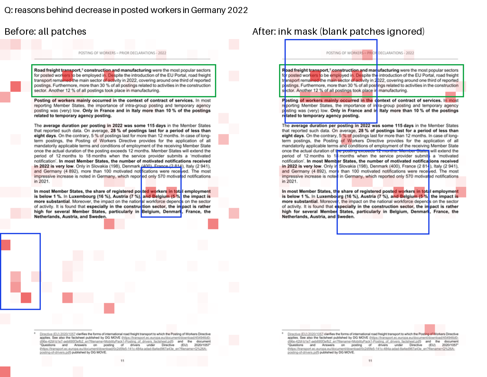

# Mira: Multimodal RAG for Visually Rich PDFs — Project Report

B.Tech minor project. Material for the final report: what was built, how it was evaluated, what
the numbers say, and what they don't. Detailed result files:
[`data/eval/results.md`](../data/eval/results.md) (custom datasheet set) and
[`data/eval/vidore_results.md`](../data/eval/vidore_results.md) (ViDoRe V3). Design questions and
answers: [`FAQ.md`](../FAQ.md).

---

## 1. Problem

Text-only RAG converts a PDF to text before retrieval. For technical documents that loses the
evidence: tables lose their structure, charts become a caption, block diagrams and pinouts become
nothing, and scanned pages depend on OCR. The other failure is the reverse: questions about exact
identifiers (`STM32F401RE`, register `0x2D`, pin `USB_VBUS`) need exact string matching, which
pure visual retrieval does only approximately.

Mira answers questions over a PDF collection by retrieving **pages as images** and as text, fusing
the two rankings, cropping the evidence region on each page, and having a vision-language model
answer from those crops with citations down to the region.

## 2. Contributions

1. **Query-adaptive hybrid fusion.** Visual late-interaction retrieval (ColQwen2.5) and BM25,
   combined with weighted Reciprocal Rank Fusion whose weights depend on the query: identifiers or
   quoted strings lean lexical, figure/table words lean visual.
2. **Query-adaptive evidence cropping.** The retriever's own patch-level similarities form a
   heatmap over the page; regions are cut from it (re-rendered at 300 DPI for PDFs) and sent to the
   VLM instead of the whole page, and each answer cites page + box.
3. **An honest evaluation** on two benchmarks with significance tests: a custom 47-query datasheet
   set and three subsets of ViDoRe V3 (897 queries, 4,783 pages), covering retrieval, cropping
   (zone F1 against human boxes), and answer correctness (local LLM judge).
4. A working **API and demo** (FastAPI + Gradio) that shows the heatmap, crops, citations and the
   fusion weights per query.

## 3. System

```
Ingestion                                   Query
PDF ─┬─ render pages (150 DPI) ─ ColQwen2.5 ─ patch vectors ─┐      question
     │                         └─ ink mask ──────────────────┤        │
     └─ native text (+OCR) ─── BM25 (bm25s) ─────────────────┤   ┌────┴─────┐
                                                   Qdrant ◄──┘   ColQwen   BM25    query features
                                                                 MaxSim    top-50  → weights
                                                                 top-50      │        │
                                                                    └── weighted RRF ─┘
                                                                          top-3 pages
                                                                              │
                                                    heatmap (content patches) → ≤2 boxes/page
                                                                              │
                                                          crops @300 DPI → Qwen2.5-VL-3B
                                                                              │
                                                       {"evidence_ids", "answer"} + citations
```

| Phase | Component | Implementation |
|---|---|---|
| 1 | PDF processing | PyMuPDF rendering at 150 DPI; native text; EasyOCR for scanned pages (`mira/pdf/`) |
| 2 | Visual index | `vidore/colqwen2.5-v0.2`, fp16 (bf16 retry on overflow), one 128-d vector per patch; Qdrant multivector collection, exact MaxSim (`mira/retrieval/colqwen.py`, `qdrant_store.py`) |
| 3 | Text index | Page-level BM25 (`bm25s`) with a tokenizer that keeps identifiers whole and also indexes their parts (`lexical.py`) |
| 4 | Fusion | Weighted RRF, k = 60, 50 candidates per channel, query-adaptive weights (`hybrid.py`) |
| 5 | Evidence cropping | Patch heatmap over content patches → thresholded regions → crops (`mira/evidence/`) |
| 6 | Generation | Qwen2.5-VL-3B-Instruct, 4-bit NF4, total image budget per request; JSON answer with evidence ids (`mira/generation/`) |
| 7 | Evaluation | Custom set + ViDoRe V3; nDCG/MRR/recall, zone F1, LLM judge, paired bootstrap (`mira/evaluation/`, `scripts/eval_*.py`) |
| — | Serving | FastAPI `POST /query` + Gradio UI at `/ui` (`mira/serve.py`) |

### 3.1 Query-adaptive fusion

```
RRF(d) = w_v / (60 + rank_visual(d)) + w_l / (60 + rank_lexical(d))
w_v = 1 − s,  w_l = 1 + s,  s = 0.5 × ([identifier or quoted text] − [visual cue word])
```

- *Identifier*: hex (`0x2D`), letter–digit mixes (`STM32F401RE`, `I2C`), snake case (`VDD_IO`),
  and all-caps words of ≥ 5 letters (`TXPOWER`). Quantities, ordinals, quarters and years
  (`2ns`, `100mA`, `1950s`, `Q4`, `FY2024`) are excluded.
- *Visual cue*: figure, chart, table, diagram, plot, pinout, …
- Both or neither → equal weights. No model call; the features are logged with every result.

Rank fusion avoids putting BM25 scores and MaxSim scores on a common scale.

### 3.2 Evidence cropping

For each query token, every page patch is scored by dot product and only the token's top 16
patches are kept, weighted by how peaked the token is (max − mean similarity; filler tokens that
match everywhere get ~0). The per-patch sum, scaled to a max of 1, is the heatmap. Patches above
0.1 are grouped into connected regions; the two hottest regions (each with ≥ 25% of the best
region's heat) become boxes, padded by 2% and grown to at least 25% of the page in each
dimension, since the VLM needs context around the hot spot.

The key fix (Section 5.2): **only patches with ink are scored.** An ink mask (pixel standard
deviation > 8 on each patch cell) is computed at index time and stored in the Qdrant payload.

### 3.3 Generation

The VLM gets the question and labelled evidence images (`E1`, `E2`, …) and must reply
`{"evidence_ids": [...], "answer": "..."}`; the ids map back to page + box citations. All images
in one request share a budget of 3 × 1024 × 28 × 28 pixels (downscaled with aspect ratio kept),
which is what lets six crops fit beside ColQwen on a 16 GB T4.

## 4. Experimental setup

| | Custom datasheet set | ViDoRe V3 |
|---|---|---|
| Corpus | 22 PDFs (datasheets, manuals, papers), 2,674 pages, 3 scanned | `hr` 1,110 pages, `computer_science` 1,360, `pharmaceuticals` 2,313 |
| Queries | 47, written from the PDFs: 15 identifier, 16 visual, 16 semantic | English only: 318, 215, 364 |
| Labels | relevant page(s) per query, binary | graded qrels (2 / 1), annotator boxes, reference answers |
| Metrics | R@k, MRR, nDCG@10 | graded nDCG@5 (headline), zone F1, judge score |

- Hardware: a single NVIDIA T4 (16 GB) on Kaggle; the full evaluation is one ~4.5 h session.
- Answer correctness: a local Qwen2.5-7B-Instruct (4-bit) judge compares each answer to V3's
  reference, verdict correct / partial / incorrect (1 / 0.5 / 0). First 60 English queries per
  subset, three context strategies each (540 answers).
- Significance: paired bootstrap (10,000 resamples) on per-query scores.
- Tuning discipline: fusion shift (0.5) set by hand before any evaluation and never tuned; crop
  parameters tuned on `hr` only, with `computer_science` and `pharmaceuticals` held out.

## 5. Results

### 5.1 Retrieval

**Custom datasheet set (47 queries):**

| Mode | R@1 | R@5 | MRR | nDCG@10 |
|---|---:|---:|---:|---:|
| **adaptive** | **0.638** | **0.904** | **0.847** | **0.844** |
| fixed 1:1 | 0.585 | 0.894 | 0.814 | 0.824 |
| visual only | 0.543 | 0.883 | 0.791 | 0.801 |
| lexical only | 0.532 | 0.798 | 0.724 | 0.751 |

Adaptive − fixed nDCG@10: +0.020, 95% CI [−0.003, +0.048], p = 0.10. Fusion beats either channel
alone; adaptive beats every fixed weighting in a sweep (best fixed: 0.824 at 1:1).

**ViDoRe V3 (nDCG@5):**

| Subset | adaptive | fixed | **visual** | lexical | adaptive − fixed (p) |
|---|---:|---:|---:|---:|---|
| hr | 0.558 | 0.562 | **0.576** | 0.475 | −0.005 (0.015) |
| computer_science | 0.722 | 0.725 | **0.734** | 0.627 | −0.003 (0.18) |
| pharmaceuticals | 0.598 | 0.601 | **0.611** | 0.538 | −0.002 (0.29) |


**Finding:** fusion helps on identifier-heavy technical documents; on ViDoRe, equal-weight and
adaptive fusion slightly trail visual-only, because ColQwen is strong there (it was trained on
ViDoRe-style data) and BM25 is 0.07–0.11 nDCG weaker. The fixed-weight sweep (figure) shows the
best balance depends on the corpus: 1:1 on the datasheets, about 4:1 visual on V3, where it edges
out visual-only on two of three subsets (+0.007/+0.008; read off the test results, so not a tuned
claim). The adaptive rule only shifts weights per query around a 1:1 centre; it fires on 47% of
custom queries but 6–16% of V3 queries. A corpus-level prior on the centre, then the per-query
shift, is the natural next step.

### 5.2 Evidence cropping

Zone F1 against V3 annotator zones on gold pages (human agreement 0.602):

| Subset | whole page | single hottest patch | **heatmap crops** |
|---|---:|---:|---:|
| hr (tuning) | 0.358 | 0.194 | **0.483** |
| computer_science (held out) | 0.303 | 0.176 | **0.408** |
| pharmaceuticals (held out) | **0.672** | 0.159 | 0.486 |

The first version scored **at chance**: the hottest patch landed in the gold zone 25% of the time
against 27% for a random patch, and heatmap F1 was 0.23. Rendering heatmaps over pages showed
blank margins lighting up for every query token, the "attention sink" behaviour of vision
transformers. Scoring only patches with ink fixed it (hit rate 60%, F1 0.48 on hr), after ruling
out a transposed grid, prompt tokens and mean-centering as causes.



On slide-style pages (pharmaceuticals) the gold zones cover about half the page, so the whole page
scores better under pixel F1.

### 5.3 Answer correctness

Judge score (correct = 1, partial = 0.5), 60 queries per subset:

| Subset | whole pages | single-patch crops | **heatmap crops** |
|---|---:|---:|---:|
| hr | **0.625** | 0.375 | 0.508 |
| computer_science | 0.700 | 0.608 | **0.725** |
| pharmaceuticals | **0.617** | 0.375 | 0.608 |
| pooled difference vs whole pages | — | −0.194 (p < 0.001) | −0.033 (p = 0.29) |

**Finding:** heatmap crops answer as well as whole pages overall (no significant difference) while
also localizing the evidence on the page; naive single-patch cropping clearly hurts. Whole pages
still win on hr, where questions are long and analytical. Latency is 15–16 s per answer on a T4 for
both, set by the shared pixel budget.

A second model (Claude) re-graded 30 judged answers and agreed on 83%; the judge was harsh on
terse correct answers ("Yes."), lenient on fluent generic ones. That is LLM–LLM agreement; a human
check of a sample is still to do. Paired comparisons are more trustworthy than the
absolute scores.

### 5.4 Demo

`python -m mira.serve` serves `POST /query` and a Gradio UI at `/ui`: the answer with citations,
each retrieved page with the heatmap and evidence boxes overlaid, the crops the VLM read, and each
page's visual/BM25 rank and the query's fusion weights. Dropdowns switch fusion mode and crop
strategy. It runs on a Kaggle T4 notebook with a public share link
(`scripts/kaggle_demo.sh`); an automated end-to-end check (`scripts/demo_smoke.py`) passes there.

## 6. Limitations

- **The custom set is small and self-labelled.** 47 queries written from the PDFs and treated as
  ground truth; a human check of the labels is still pending. Adaptive vs fixed there is p = 0.10.
- **The judge is a 7B model**, checked only against another LLM on 30 answers, not against human grades.
- **Three of eight V3 subsets**, first 60 queries for generation; crop parameters tuned on one of them.
- **Cropping loses on large-zone pages** (slides); there is no page-vs-crop fallback yet.
- **Exact MaxSim scans every page** — fine at a few thousand pages, needs HNSW or a two-stage
  search beyond that.
- 3% of VLM replies hit the 256-token limit; the parser now salvages them, but the reported numbers
  predate that fix.

## 7. Future work

1. Fusion: a corpus-level prior for the centre weight (e.g. from each channel's agreement with the
   other on unlabelled queries), then the per-query shift; tune on the custom set and one V3
   subset, test on the rest.
2. Cropping: fall back to the whole page when heat is spread out; per-page region count.
3. Human grading of a sample of answers to calibrate the judge.
4. Remaining V3 subsets, including the French ones (ColQwen is multilingual; BM25 needs a French
   analyzer).

## 8. Reproducing

```bash
uv sync --all-extras && uv run pytest                     # CPU tests (93 pass, GPU tests skip)
scripts/test_kaggle.sh                                    # tests + example on a Kaggle T4
scripts/test_kaggle.sh --dataset <you>/mira-custom-embeddings \
    --run 'bash scripts/kaggle_full_eval.sh' mira-full    # the whole evaluation (~4.5 GPU-h)
python scripts/rescore_fusion.py .cache/kaggle/mira-full/rankings_hr.jsonl --vidore hr   # CPU
python scripts/make_figures.py fusion curves.json docs/figures/fusion_weights.png
```

Engineering notes worth a paragraph in the report: Colab's free T4 reclaims sessions mid-run, so
evaluation moved to Kaggle batch kernels (code embedded in the kernel, Qdrant on the VM, no
credentials leave the machine); a CUDA OOM in the first full run led to the shared image budget;
every evaluation dumps per-query rankings so fusion variants can be re-scored on CPU without a GPU.

## Data and licences

ViDoRe V3 (queries, qrels, boxes, reference answers, page images): CC BY 4.0. The `hr` page
images are European Commission publications (CC BY 4.0). The custom corpus PDFs are third-party
documents used locally for evaluation and are not redistributed.
